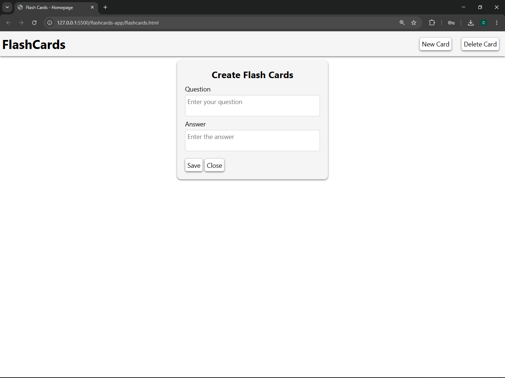

# Flashcards App

## Description
A simple flashcard app that allows users to create, view, and delete flashcards. Built using HTML, CSS, and JavaScript.

## Features
- Add new flashcards
- Toggle between question and answer
- Delete individual flashcards
- Data persists using localStorage

## How to Run
1. Clone the repository
2. Open flashcards.html in your browser

## Tech Stack
- HTML
- CSS
- JavaScript
